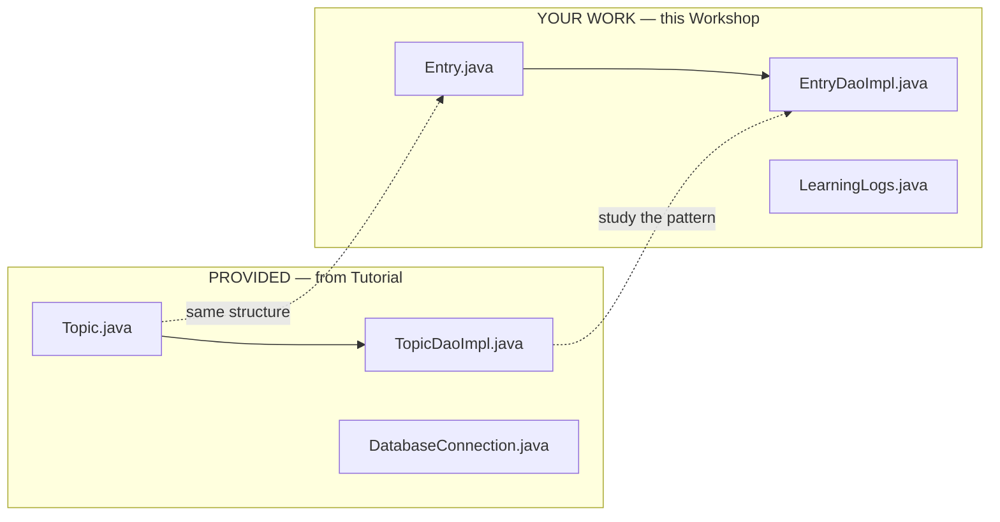
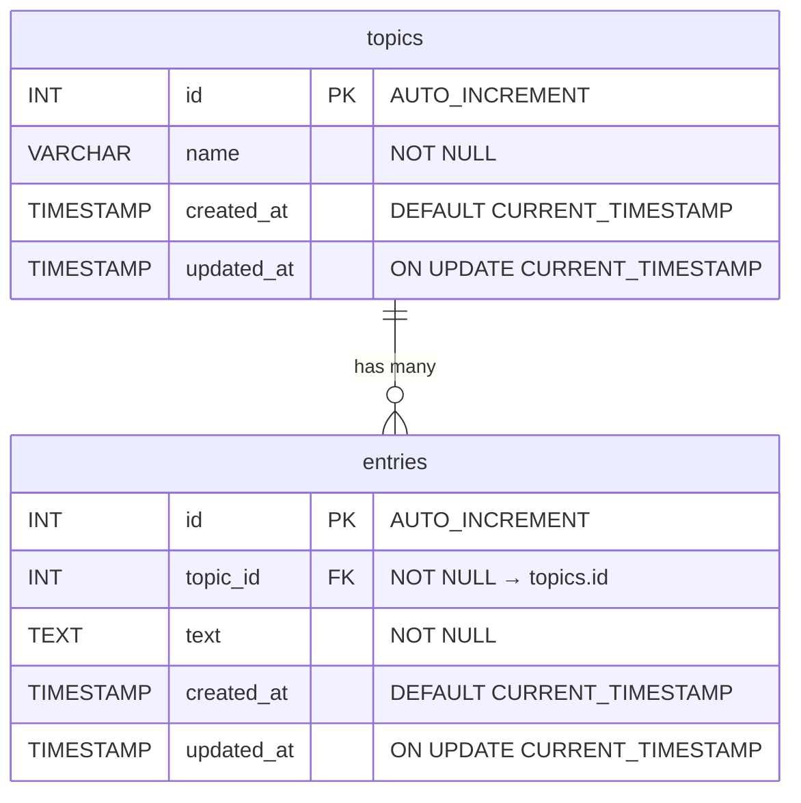
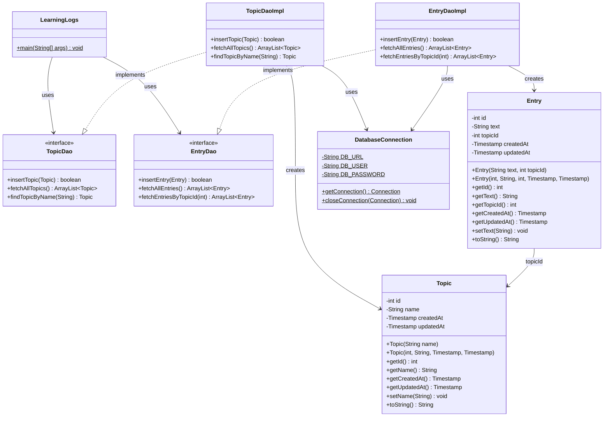
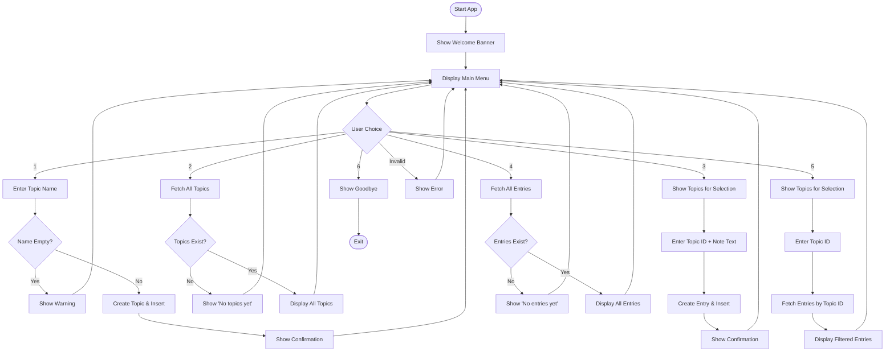
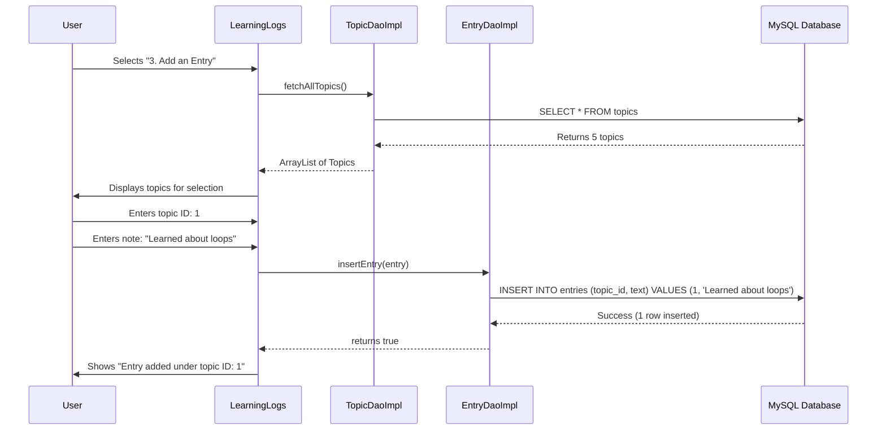
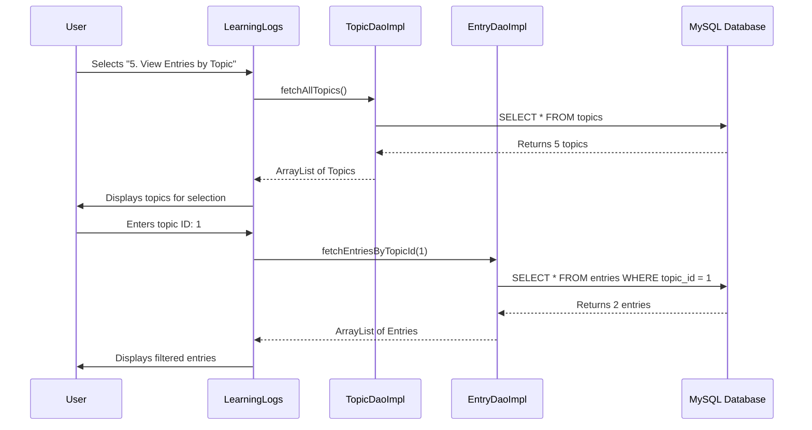

[](https://classroom.github.com/a/DR_deGFA)
# Learning Logs Terminal — Workshop

### Week 2 — Workshop: JDBC Entries + Database CRUD

> *"Every entry you write is knowledge that persists."*

---

## Why This Workshop Matters

In the **tutorial**, you learned how to connect Java to a MySQL database using JDBC. You built the Topic entity, set up `DatabaseConnection`, and implemented `TopicDaoImpl` — all for **Topics only**.

Now it's time to apply that pattern to a **second entity: Entries**. Entries are learning notes that belong to a Topic. This is where JDBC gets real — you'll work with:

- **Foreign keys** — entries reference topics via `topic_id`
- **Multi-parameter PreparedStatements** — INSERT with two `?` placeholders
- **The full DAO pattern** — from entity to interface to implementation
- **WHERE clauses** (bonus) — filtering data instead of fetching everything

### Tutorial vs Workshop

| | Tutorial | Workshop |
|--|---------|----------|
| **Scope** | Topics only | Topics + Entries |
| **Entity** | Topic.java (your work) | Topic (provided) + Entry.java (your work) |
| **DAO** | TopicDaoImpl (your work) | TopicDaoImpl (provided) + EntryDaoImpl (your work) |
| **SQL concepts** | INSERT, SELECT * | INSERT with FK, SELECT * (+ WHERE in bonus) |
| **Menu** | 3 options | 6 options |
| **Seed data** | 5 topics | 5 topics + 10 entries |

### What's Already Done For You

The Topic layer is **complete and provided** — you built it in the tutorial! Now use it as a **reference** to build the Entry layer. This mirrors real development: read existing code, then extend the pattern.



---

## Quest Overview

Your mission: **complete 9 core TODOs** (+ 4 bonus) across 3 files to add Entry support!

```
╔══════════════════════════════════════════╗
║     Welcome to Learning Logs Terminal    ║
║     Now with Database Storage!           ║
╚══════════════════════════════════════════╝

┌──────────────────────────────┐
│         MAIN MENU            │
├──────────────────────────────┤
│  1. Add a new Topic          │  ← PROVIDED
│  2. View all Topics          │  ← PROVIDED
│  3. Add an Entry             │  ← TODO 9
│  4. View all Entries         │  ← TODO 10
│  5. View Entries by Topic    │  ← BONUS TODO 12
│  6. Exit                     │  ← PROVIDED
└──────────────────────────────┘
```

---

## XP System

Earn **XP** by completing each TODO. Collect all **395 XP** to master this quest!

### Task 1: Entry Entity — `Entry.java` (120 XP)

Build the Entry class following the same pattern as the provided Topic.java.

| TODO | Task | XP | File |
|------|------|----|------|
| 1 | Declare Entry fields (`id`, `text`, `topicId`, `createdAt`, `updatedAt`) | 40 XP | `Entry.java` |
| 2 | Create insert constructor `Entry(String text, int topicId)` | 20 XP | `Entry.java` |
| 3 | Create full constructor (all 5 fields) | 20 XP | `Entry.java` |
| 4 | Create getters and setter | 20 XP | `Entry.java` |
| 5 | Override `toString()` | 20 XP | `Entry.java` |

### Task 2: Entry DAO — `EntryDaoImpl.java` (110 XP)

Apply the JDBC pattern from TopicDaoImpl to build entry database operations.

| TODO | Task | XP | File |
|------|------|----|------|
| 7 | Implement `insertEntry()` — INSERT with two parameters | 50 XP | `EntryDaoImpl.java` |
| 8 | Implement `fetchAllEntries()` — SELECT with ResultSet loop | 60 XP | `EntryDaoImpl.java` |

### Task 3: Main Menu — `LearningLogs.java` (65 XP)

Wire up the entry menu options to your DAO methods.

| TODO | Task | XP | File |
|------|------|----|------|
| 9 | Add Entry menu case (show topics, pick ID, enter text, insert) | 40 XP | `LearningLogs.java` |
| 10 | View all Entries menu case | 25 XP | `LearningLogs.java` |

### Bonus Tasks (100 XP)

| TODO | Task | XP | File |
|------|------|----|------|
| 6 | Implement `findTopicByName()` — case-insensitive search with WHERE | 40 XP | `TopicDaoImpl.java` |
| 11 | Implement `fetchEntriesByTopicId()` — SELECT with WHERE | 20 XP | `EntryDaoImpl.java` |
| 12 | View Entries by Topic menu case | 20 XP | `LearningLogs.java` |
| 13 | Prevent duplicate topic names (requires TODO 6 first) | 20 XP | `TopicDaoImpl.java` |

| | **Core Total** | **295 XP** |
|--|----------------|------------|
| | **With Bonus** | **395 XP** |

### Achievement Badges

| Badge | Name | How to Earn |
|-------|------|-------------|
| 📝 | **Scribe** | Complete Entry entity (TODO 1–5) |
| ⚙️ | **Engineer** | Implement `insertEntry()` (TODO 7) |
| 🔧 | **Builder** | Implement `fetchAllEntries()` (TODO 8) |
| 🎮 | **Operator** | Complete Main Menu (TODO 9–10) |
| 🔍 | **Seeker** | Implement `findTopicByName()` (BONUS 6) |
| ⭐ | **Master** | Complete all Bonus TODOs (6, 11–13) |

---

## Prerequisites — What You Need

| Tool | Why You Need It |
|------|----------------|
| **JDK 25** | Compiles and runs your Java code |
| **Maven** | Manages dependencies and builds the project |
| **XAMPP** | Provides MySQL database + phpMyAdmin |
| **IntelliJ IDEA** | Your code editor |

### Verify Your Setup

```bash
java --version    # Should show: openjdk 25
mvn --version     # Should show: Apache Maven 3.x.x
```

---

## Database Setup

### Step 1: Start XAMPP

1. Open **XAMPP Control Panel**
2. Click **Start** next to **Apache**
3. Click **Start** next to **MySQL**

### Step 2: Import Seed Data

Your `learning_logs` database already exists from the tutorial. You just need to add sample entries:

1. Open **http://localhost/phpmyadmin**
2. Select the `learning_logs` database
3. Click **Import** → Choose `sql/seed.sql` → Click **Go**

### Step 3: Verify

In phpMyAdmin, you should see:
- Database: `learning_logs` (from tutorial)
- Table: `topics` (5 rows from tutorial seed)
- Table: `entries` (10 sample rows — 2 per topic)

### Database Schema



> **Foreign Key:** Each entry has a `topic_id` that points to a topic's `id`. If a topic is deleted, all its entries are automatically removed (`ON DELETE CASCADE`).

---

## Project Structure

```
src/main/java/com/learninglogs/
├── LearningLogs.java              ← PROVIDED (topics) + YOUR WORK (TODO 9-10, BONUS 12)
├── entity/
│   ├── Topic.java                 ← PROVIDED (study it!)
│   └── Entry.java                 ← YOUR WORK (TODO 1-5)
├── dao/
│   ├── TopicDao.java              ← PROVIDED (interface)
│   ├── TopicDaoImpl.java          ← PROVIDED (study it!) + BONUS (TODO 6, 13)
│   ├── EntryDao.java              ← PROVIDED (interface)
│   └── EntryDaoImpl.java          ← YOUR WORK (TODO 7-8, BONUS 11)
└── utils/
    └── DatabaseConnection.java    ← PROVIDED (study it!)
```

### What Each File Does

| File | Role | Status |
|------|------|--------|
| `LearningLogs.java` | Main menu — options 1-2 provided, 3-4 are TODOs, 5 is bonus | Partial |
| `Topic.java` | Entity — maps to `topics` table | PROVIDED |
| `Entry.java` | Entity — maps to `entries` table | TODO 1–5 |
| `DatabaseConnection.java` | Utility — manages database connections | PROVIDED |
| `TopicDao.java` | Interface — defines topic operations | PROVIDED |
| `TopicDaoImpl.java` | Implementation — topic SQL queries provided | PROVIDED (+ BONUS 6, 13) |
| `EntryDao.java` | Interface — defines entry operations | PROVIDED |
| `EntryDaoImpl.java` | Implementation — entry SQL queries | TODO 7–8, BONUS 11 |

---

## Class Diagram



> **Reading the arrows:** Dotted triangle (◁┄) = implements interface | Solid arrow (→) = dependency (creates, uses)

---

## Application Flow



---

## How It Works — Adding an Entry



---

## How It Works — Viewing Entries by Topic



---

## Getting Started

### Step 1: Set Up Database
Import `sql/seed.sql` in phpMyAdmin to add sample data (see Database Setup above).

### Step 2: Open the Project
Open this project in **IntelliJ IDEA** (File → Open → select the project folder).

### Step 3: Study the Provided Code
Read these files first — they show the complete JDBC pattern:
1. **`Topic.java`** — entity pattern you'll replicate for Entry
2. **`TopicDaoImpl.java`** — JDBC pattern you'll replicate for EntryDaoImpl
3. **`DatabaseConnection.java`** — connection utility used everywhere

### Step 4: Complete the TODOs

**Recommended order:**
1. **`Entry.java`** (TODO 1–5) → build the entity first
2. **`EntryDaoImpl.java`** (TODO 7–8) → implement database operations
3. **`LearningLogs.java`** (TODO 9–10) → wire up the menu
4. **Bonus TODOs** (6, 11–13) → extra challenges

### Step 5: Run the App
Make sure XAMPP MySQL is running, then:
```bash
mvn compile exec:java
```
Or run `LearningLogs.java` directly from IntelliJ (right-click → Run).

---

## Expected Output

```
╔══════════════════════════════════════════╗
║     Welcome to Learning Logs Terminal    ║
║     Now with Database Storage!           ║
╚══════════════════════════════════════════╝

Choose an option (1-6): 2

── Your Topics ──────────────────
  [1] Python (Created: 2026-02-24 10:00:00.0)
  [2] Web Development (Created: 2026-02-24 10:00:00.0)
  [3] Data Science (Created: 2026-02-24 10:00:00.0)
  [4] Machine Learning (Created: 2026-02-24 10:00:00.0)
  [5] Cybersecurity (Created: 2026-02-24 10:00:00.0)
─────────────────────────────────
  Total: 5 topic(s)

Choose an option (1-6): 4

── All Entries ──────────────────
  [1] Python is a versatile language... (Topic ID: 1, Created: 2026-02-24 10:00:00.0)
  [2] Learning about list comprehensions... (Topic ID: 1, Created: 2026-02-24 10:00:00.0)
  [3] HTML, CSS, and JS are the holy trinity... (Topic ID: 2, Created: 2026-02-24 10:00:00.0)
  ...
─────────────────────────────────

Choose an option (1-6): 3

── Select a Topic ───────────────
  [1] Python (Created: 2026-02-24 10:00:00.0)
  [2] Web Development (Created: 2026-02-24 10:00:00.0)
  ...
─────────────────────────────────
Enter topic ID: 1
Enter your learning note: Learned about loops
Entry added under topic ID: 1

Choose an option (1-6): 6

Happy Learning! See you next time.
```

---

## Test Cases

### Topics

| # | Action | Input | Expected Result |
|---|--------|-------|-----------------|
| 1 | View topics (seed data) | Option 2 | 5 topics displayed |
| 2 | Add a topic | "Networking" | Topic added |
| 3 | Add topic with empty name | Press Enter | "Topic name cannot be empty!" |

### Entries

| # | Action | Input | Expected Result |
|---|--------|-------|-----------------|
| 4 | View all entries (seed data) | Option 4 | 10 entries displayed |
| 5 | Add an entry | Topic ID: 1, Text: "Learned loops" | Entry inserted |
| 6 | View entries after adding | Option 4 | 11 entries displayed |
| 7 | Add entry with empty text | Empty text | "Entry text cannot be empty!" |
| 8 | Add entry with invalid ID | "abc" | "Please enter a valid number!" |
| 9 | Exit and restart | Run again | All data persists |

### Bonus

| # | Action | Input | Expected Result |
|---|--------|-------|-----------------|
| 10 | Find topic by name | `findTopicByName("python")` | Returns Python topic (case-insensitive) |
| 11 | View entries by topic | Option 5, Topic ID: 1 | 2-3 entries for Python |
| 12 | Add duplicate topic | "Python" (exists) | Rejected with message |
| 13 | Restart program | Run again | All data still there |

---

## XP Progress Tracker

Check off each task as you complete it:

### Task 1: Entry Entity
- [ ] **TODO 1** — Declare Entry fields (40 XP)
- [ ] **TODO 2** — Create insert constructor (20 XP)
- [ ] **TODO 3** — Create full constructor (20 XP)
- [ ] **TODO 4** — Create getters and setter (20 XP)
- [ ] **TODO 5** — Override `toString()` (20 XP)
- [ ] Achievement Unlocked: **📝 Scribe**

### Task 2: Entry DAO
- [ ] **TODO 7** — Implement `insertEntry()` (50 XP)
- [ ] Achievement Unlocked: **⚙️ Engineer**
- [ ] **TODO 8** — Implement `fetchAllEntries()` (60 XP)
- [ ] Achievement Unlocked: **🔧 Builder**

### Task 3: Main Menu
- [ ] **TODO 9** — Add Entry menu case (40 XP)
- [ ] **TODO 10** — View all Entries menu case (25 XP)
- [ ] Achievement Unlocked: **🎮 Operator**

### Bonus Tasks
- [ ] **BONUS 6** — Implement `findTopicByName()` (40 XP)
- [ ] Achievement Unlocked: **🔍 Seeker**
- [ ] **BONUS 11** — Implement `fetchEntriesByTopicId()` (20 XP)
- [ ] **BONUS 12** — View Entries by Topic menu case (20 XP)
- [ ] **BONUS 13** — Prevent duplicate topic names (20 XP)
- [ ] Achievement Unlocked: **⭐ Master**

### Final Test
- [ ] Start XAMPP MySQL
- [ ] Run the app with `mvn compile exec:java`
- [ ] View the 5 seed topics
- [ ] View the 10 seed entries
- [ ] Add a new entry under a topic
- [ ] Restart the app — entry is still there!

**Your Total: ___ / 395 XP**

---

## Hints & Tips

### JDBC Pattern Reminder

Every database method follows this pattern:

```java
Connection conn = null;
try {
    conn = DatabaseConnection.getConnection();
    String sql = "YOUR SQL HERE";
    PreparedStatement statement = conn.prepareStatement(sql);
    // Set parameters: statement.setString(1, value);
    // Execute: executeUpdate() for INSERT, executeQuery() for SELECT
} catch (SQLException e) {
    System.out.println("Error: " + e.getMessage());
} finally {
    DatabaseConnection.closeConnection(conn);
}
```

### Reading from ResultSet — entries table

```java
rs.getInt("id")              → entry id
rs.getString("text")         → entry text
rs.getInt("topic_id")        → which topic it belongs to
rs.getTimestamp("created_at") → when it was created
rs.getTimestamp("updated_at") → when it was last updated
```

### The WHERE Clause (Bonus)

The core TODOs use `INSERT` and `SELECT *`. The bonus TODOs introduce `WHERE` to filter results:

```sql
-- Core: get ALL entries
SELECT * FROM entries

-- Bonus 11: get entries for ONE topic
SELECT * FROM entries WHERE topic_id = ?

-- Bonus 6: find topic by name (case-insensitive)
SELECT * FROM topics WHERE LOWER(name) = LOWER(?)
```

The `?` is filled by `statement.setInt(1, topicId)` or `statement.setString(1, name)`.

### Foreign Keys

The `entries` table has `topic_id` — a foreign key that references `topics.id`:

**topics table:**

| id | name    |
|----|---------|
| 1  | Python  |
| 2  | Web Dev |

**entries table:**

| id | topic_id | text                    |
|----|----------|-------------------------|
| 1  | **1** → Python | Python is versatile...  |
| 2  | **1** → Python | List comprehensions...  |
| 3  | **2** → Web Dev | HTML, CSS, JS...        |

When inserting an entry, you must provide a valid `topic_id` that exists in the `topics` table.

### Common Mistakes

- **Forgot to start XAMPP MySQL?** → `Connection refused` error
- **Forgot to import seed.sql?** → No seed data shows up
- **Used `executeQuery()` for INSERT?** → Use `executeUpdate()` instead
- **Forgot `statement.setInt()` for the `?`?** → SQL error about parameter count
- **Mixed up `while` and `if` for ResultSet?** → `while (rs.next())` for multiple rows, `if (rs.next())` for one row

---

*Informatics College Pokhara — Java Programming By Sandesh Hamal*
